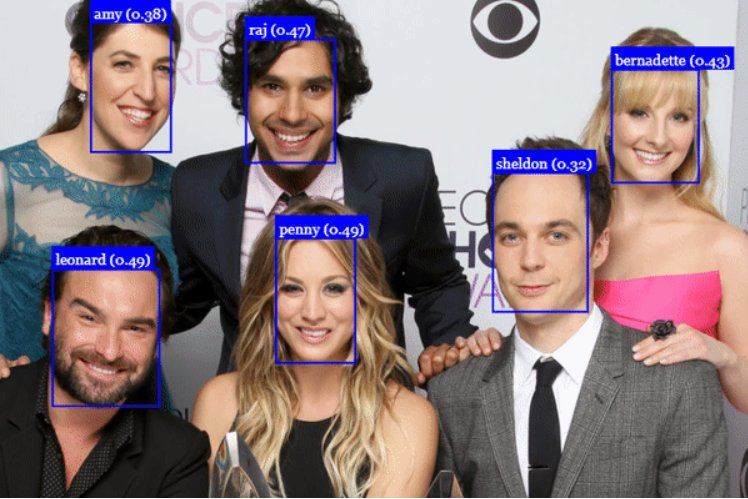

# 🎭 Sistema de Reconhecimento Facial com TensorFlow



> Sistema de **detecção e reconhecimento facial** em tempo real utilizando TensorFlow, capaz de identificar múltiplos rostos simultaneamente com bounding boxes e scores de confiança.

---

## 📋 Descrição

Este projeto implementa um pipeline de duas etapas para reconhecimento facial:

1. **Detecção** — Localiza rostos na imagem usando MTCNN ou SSD MobileNet
2. **Reconhecimento** — Classifica cada rosto detectado com uma rede CNN treinada via Transfer Learning (FaceNet / InceptionV3)

O resultado final é uma imagem anotada com bounding boxes, nome da pessoa e score de confiança — como na figura acima com os personagens do Big Bang Theory.

---

## 🗂️ Estrutura do Projeto

```
face-recognition-project/
├── dataset/
│   ├── train/
│   │   ├── pessoa_1/       # Uma pasta por pessoa
│   │   ├── pessoa_2/
│   │   └── .../
│   ├── val/
│   └── test/
├── scripts/
│   ├── collect_faces.py    # Extrai/organiza faces do dataset
│   ├── preprocess.py       # Pré-processamento e data augmentation
│   ├── train.py            # Treinamento do classificador
│   └── recognize.py        # Inferência em imagens/webcam
├── models/
│   └── (pesos salvos aqui)
├── notebooks/
│   └── face_recognition_colab.ipynb
├── results/
├── docs/
│   └── example_detection.png
├── requirements.txt
├── setup.sh
└── README.md
```

---

## 🚀 Como Usar

### 1. Clone e instale

```bash
git clone https://github.com/SEU_USUARIO/face-recognition-project.git
cd face-recognition-project
bash setup.sh
```

### 2. Organize o dataset

Crie uma pasta por pessoa em `dataset/train/`:

```
dataset/train/
├── sheldon/
│   ├── img001.jpg
│   └── ...
├── penny/
│   └── ...
└── leonard/
    └── ...
```

> 💡 Recomendado: mínimo 20–50 imagens por pessoa, com variações de ângulo e iluminação.

### 3. Pré-processe os dados

```bash
python scripts/preprocess.py \
    --input  dataset/train/ \
    --output dataset/train_processed/ \
    --size   160
```

### 4. Treine o classificador

```bash
python scripts/train.py \
    --data_dir  dataset/train_processed/ \
    --model     inceptionv3 \
    --epochs    30 \
    --batch     32 \
    --output    models/face_classifier.h5
```

### 5. Reconheça rostos

**Em uma imagem:**
```bash
python scripts/recognize.py \
    --model   models/face_classifier.h5 \
    --source  sua_imagem.jpg \
    --conf    0.35 \
    --output  results/resultado.jpg
```

**Em tempo real (webcam):**
```bash
python scripts/recognize.py \
    --model  models/face_classifier.h5 \
    --source 0 \
    --conf   0.35
```

---

## 📓 Google Colab

Para rodar sem GPU local, use o notebook:

[](notebooks/face_recognition_colab.ipynb)

**Referências de aula:**
- [Detecção Facial](https://colab.research.google.com/drive/1QnC7lV7oVFk5OZCm75fqbLAfD9qBy9bw)
- [Detecção e Classificação de Objetos](https://colab.research.google.com/drive/1xdjyBiY75MAVRSjgmiqI7pbRLn58VrbE)

---

## 🧠 Arquitetura

```
Imagem de entrada
       │
       ▼
┌─────────────────┐
│  Detector MTCNN │  ← Etapa 1: localiza rostos (bounding boxes)
└────────┬────────┘
         │  crops de rostos (160×160)
         ▼
┌─────────────────────────┐
│  InceptionV3 (backbone) │  ← Etapa 2: extrai embeddings faciais
│  + Dense + Softmax      │     via Transfer Learning
└────────┬────────────────┘
         │
         ▼
   Nome + Score de Confiança
```

---

## 📊 Métricas

| Métrica    | Valor |
|------------|-------|
| Acurácia   | —     |
| Precisão   | —     |
| Recall     | —     |
| F1-Score   | —     |

*Preencha após o treinamento.*

---

## 🛠️ Tecnologias

| Biblioteca | Versão | Uso |
|------------|--------|-----|
| TensorFlow | ≥ 2.12 | Framework principal |
| Keras | ≥ 2.12 | API de alto nível |
| MTCNN | ≥ 0.1.1 | Detecção facial |
| OpenCV | ≥ 4.7 | Leitura de imagens/vídeo |
| NumPy | ≥ 1.24 | Operações matriciais |
| scikit-learn | ≥ 1.2 | Métricas e split |
| Pillow | ≥ 9.0 | Manipulação de imagens |

---

## 📚 Referências

- Zhang, K. et al. *Joint Face Detection and Alignment using Multi-task Cascaded CNNs*. 2016.
- Schroff, F. et al. *FaceNet: A Unified Embedding for Face Recognition and Clustering*. CVPR, 2015.
- Szegedy, C. et al. *Rethinking the Inception Architecture for Computer Vision*. CVPR, 2016.

---

## 👨‍💻 Autor

Projeto desenvolvido como atividade prática do curso de Visão Computacional — Reconhecimento Facial com TensorFlow.
